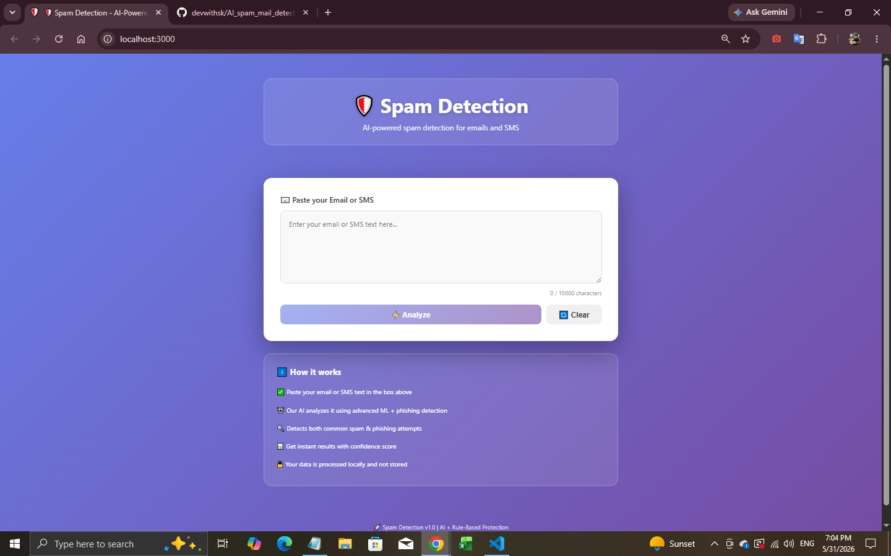
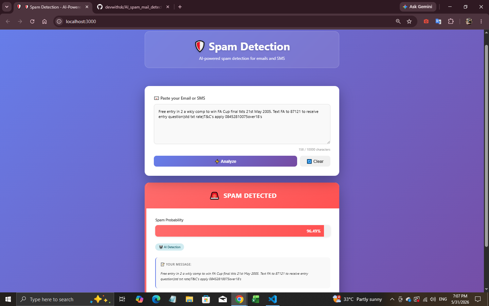
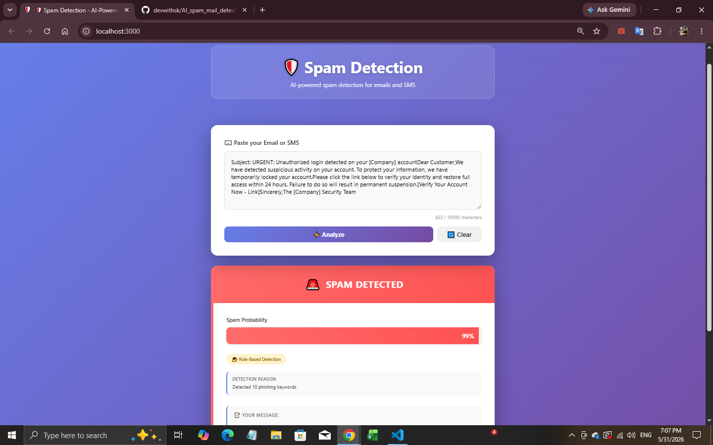

# 🛡️ AI Spam & Phishing Detection System

An advanced AI-powered spam and phishing detection platform built using Machine Learning, Natural Language Processing (NLP), Flask, and React.

This application analyzes emails and SMS messages in real time, identifies spam, phishing attempts, and suspicious content, and provides confidence scores along with intelligent threat detection.

---

## 🚀 Project Overview

Spam emails and phishing attacks are among the most common cybersecurity threats today. Many users unknowingly click malicious links, share sensitive information, or become victims of scams.

This project aims to solve that problem by using Artificial Intelligence to automatically analyze messages and classify them as:

* ✅ Safe Message
* 🚨 Spam Message
* 🛡️ Potential Phishing Attempt

The system combines Machine Learning predictions with rule-based phishing detection to improve accuracy and reliability.

---

## 🎯 Key Features

### Machine Learning Detection

* AI-powered spam classification
* TF-IDF text vectorization
* Naive Bayes classification model
* Real-time prediction

### Phishing Protection

* Detects suspicious keywords
* Identifies account verification scams
* Detects urgent-action phishing emails
* Rule-based security layer

### Modern Web Application

* React frontend
* Flask backend API
* Responsive UI
* Real-time analysis
* Confidence score display

### Security Focused

* Local processing support
* No email credentials required
* User privacy friendly
* Safe message analysis

---

## 🧠 How The AI Works

```text
User Message
      ↓
Text Cleaning
      ↓
TF-IDF Vectorization
      ↓
Naive Bayes Model
      ↓
Spam Probability
      ↓
Rule-Based Phishing Detection
      ↓
Final Result
```

The model learns patterns from thousands of spam and legitimate messages and predicts whether a new message is suspicious.

---

## 📊 Model Performance

| Metric    | Score  |
| --------- | ------ |
| Accuracy  | ~98%   |
| Precision | High   |
| Recall    | High   |
| F1 Score  | Strong |

Additional phishing detection rules help catch threats that traditional ML models may miss.

---

## 🏗️ Project Structure

```text
spam_mail_detection/
│
├── app.py
├── main.py
├── model.pkl
├── vectorizer.pkl
├── requirements.txt
│
├── frontend/
│   ├── package.json
│   ├── src/
│   │   ├── App.jsx
│   │   └── App.css
│
└── dataset/
    └── mail_data.csv
```

---

## 🔧 Technologies Used

### Machine Learning

* Python
* Scikit-Learn
* Pandas
* NumPy

### Natural Language Processing

* TF-IDF Vectorizer
* Text Preprocessing
* Keyword Analysis

### Backend

* Flask
* Flask-CORS

### Frontend

* React.js
* Tailwind CSS
* CSS3
* Responsive Design

---

## ⚡ Installation

### Clone Repository

```bash
git clone https://github.com/devwithsk/AI_spam_mail_detection.git
cd AI_spam_mail_detection
```

### Install Backend Dependencies

```bash
pip install -r requirements.txt
```

### Train Model

```bash
python main.py
```

### Start Backend

```bash
python app.py
```

### Start Frontend

```bash
cd frontend
npm install
npm start
```

Frontend runs at:

```text
http://localhost:3000
```

---

## 📸 Screenshots

### Home Page



### Spam Detection Result



### Phishing Detection Result



---

## 🔮 Future Improvements

* Gmail API Integration
* Real-time Inbox Scanning
* Attachment Scanning
* URL Reputation Analysis
* Multi-language Spam Detection
* Deep Learning Models (LSTM / Transformers)
* Browser Extension

---

## 👨‍💻 About The Developer

Hi, I'm **Sonu Kumar**.

I am currently building AI, Machine Learning, and Full Stack projects to strengthen my portfolio and gain real-world development experience.

My goal is to become a skilled AI Engineer by building practical projects that solve real-world problems rather than focusing only on theory.

### Skills

* Python
* Machine Learning
* NLP
* Flask
* React
* Git & GitHub
* Data Analysis
* Artificial Intelligence

---

## ⭐ Support

If you found this project useful, consider giving it a star ⭐ on GitHub.

Feedback, suggestions, and contributions are always welcome.

---

### Built with ❤️ using AI, Machine Learning, Flask & React
